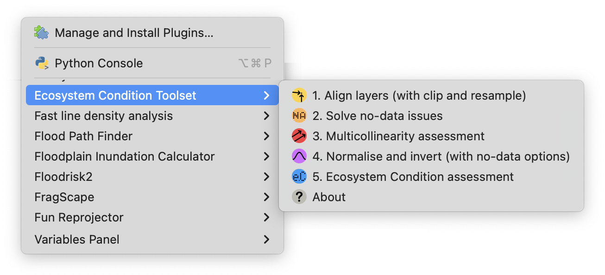
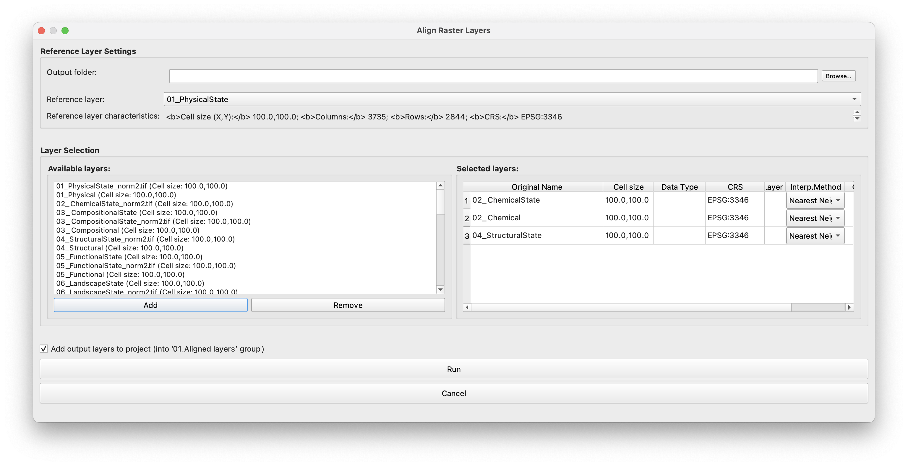
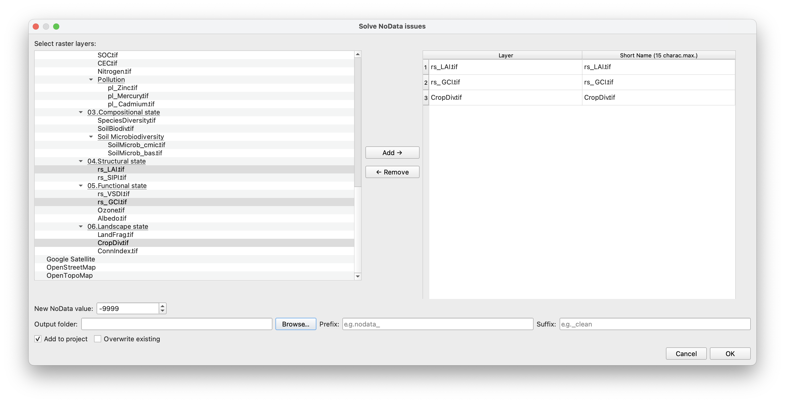
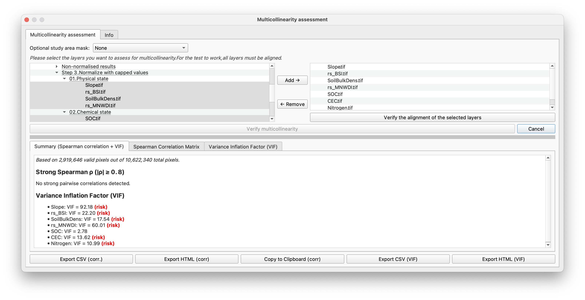
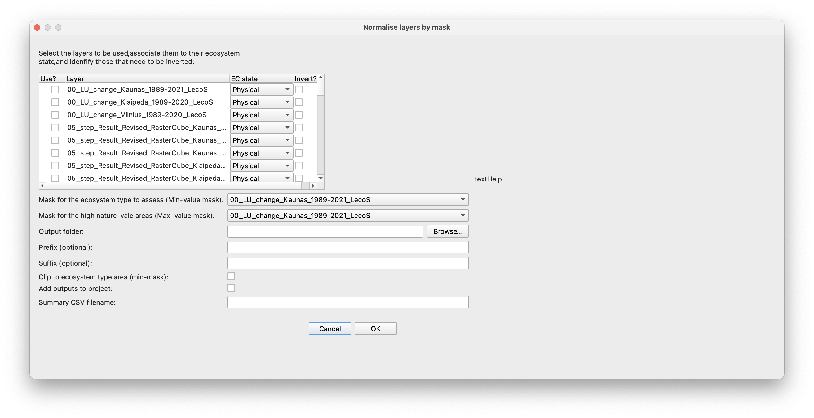
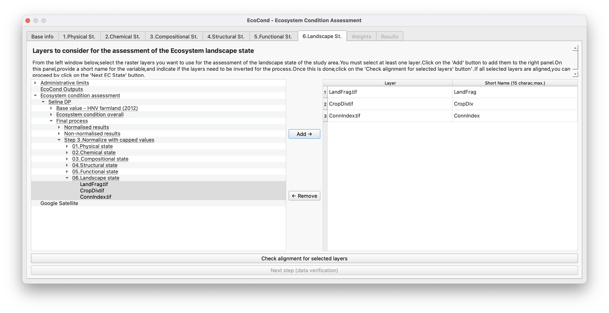
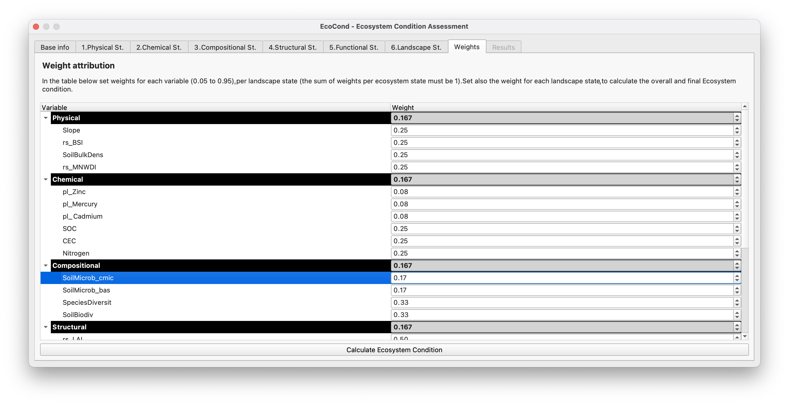

## EcoCondition Toolbox - A QGIS plugin for ecosystem condition assessment
QGIS plugin with a set of tools to prepare data for, and assess, the Ecosystem condition of any specific ecosystem type. The plugin is raster-based. The ecosystem condition assessment is based on the weighted sum of 6 specific ecosystem states (Physical, Chemical, Compositional, Structural, Functional, Landscape), following the system of environmental accounting developed by the United Nations. This plugin was developed as part of the [SELINA project](https://project-selina.eu/), at the [Environmental Management Research Laboratory](https://www.mruni.eu/en/research/mru-laboratories/environmental-management-laboratory/) ([Mykolas Romeris University](https://mruni.eu))

**Status:** 🚧 beta version

## Overview
The Ecosystem Condition plugin is a tool for QGIS that enables users to calculate ecosystem condition scores using weighted indicators, raster pre-processing, and normalisation steps.
It integrates key GIS functions required for this kind of assessment, including:
* Raster normalisation (with clipping and masking options)
* Euclidean distance calculations
* Multicollinearity checks
* Reclassification and scaling
* Weighted sum of condition indicators

## Key Features
* Modular interface with dedicated tools per step
* Optional use of min/max raster masks
* Support for noData harmonisation and raster alignment
* UX/UI designed for clarity, responsiveness, and reproducibility

## Project Background
This plugin was developed under the scope of the SELINA (Science for Evidence-based and sustainabLe decisIons about NAtural capital) project, with partial support from MAFESUR. It was implemented by Luís Pinto within the Environmental Management Research Laboratory, Mykolas Romeris University.

⚠️ Although the plugin is licensed openly and the code/UI were fully designed and implemented by the developer, the core indicator aggregation logic (weighted sum) follows specifications from the SELINA team.
Please be sure to cite SELINA and MAFESUR appropriately when using this tool in published work.

## Installation
1. Download the plugin via the GitHub repository ([https://github.com/piulintos/EcoCondition_Toolbox_for_QGIS](https://github.com/piulintos/EcoCondition_Toolbox_for_QGIS)
2. To install via ZIP file, use the 'Download ZIP' option available via the green '<> code' button
3. In QGIS, go to 'Plugins/Manage and install plugins' and select 'Install from ZIP' on the left
4. Select the downloaded ZIP file, and install

Minimum QGIS version: 3.22 (tested on QGIS 3.34 and above, in both Mac and PC environments; intended to work also in Linux).

## Dependencies
**External Python dependencies (install via pip/conda):**

- GDAL Python bindings (osgeo.gdal) (≥3.0) (install via conda: `conda install -c conda-forge gdal`, or pip: `pip install gdal`)
- numpy (≥1.18) (install via pip: `pip install numpy`)
- scipy (≥1.4) (install via: `pip install scipy`)
- pandas (≥1.0) (install via pip: `pip install pandas`)
- statsmodels (≥0.12) (optional; for VIF in Multicollinearity)

**QGIS requirements:**
- Processing plugin (must be enabled)

## Screenshots 
The EcoConditon toolset menu

The Align tool dialog

The no-data tool dialog

The multicollinearity assessment tool dialog

The normalisation tool dialog (selecting variables)

The ecosystem condition assessment tool dialog (selecting variables)

The ecosystem condition assessment tool dialog (setting weights)

The ecosystem condition assessment tool dialog (results)

## License
GPL v3 
Full license text: https://www.gnu.org/licenses/gpl-3.0.txt

This plugin is distributed under the GNU GPL v3 by Luís Pinto.

## Acknowledgments
* SELINA Project (EU Horizon Grant No. 101060415)
* MAFESUR Project. 
* [Environmental Management Research Lab](https://www.mruni.eu/en/research/mru-laboratories/environmental-management-laboratory/) – [Mykolas Romeris University](https://mruni.eu). 

Developed by [Luís Valença Pinto](mailto:lmpinto@mac.com) · Feel free to fork, adapt, or contribute.
