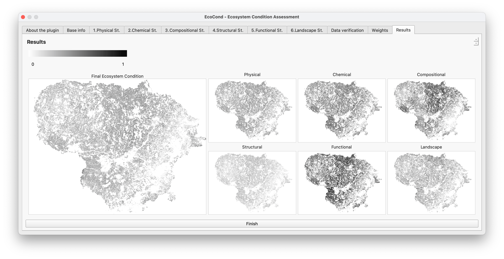

# EcoCondition Toolbox - A QGIS plugin for ecosystem condition assessment
QGIS plugin with a set of tools to prepare data for, and assess, the Ecosystem condition of any specific ecosystem type. Based on the weighted sum of 6 specific ecosystem states (Physical, Chemical, Compositional, Structural, Functional, Landscape), following the system of environmental accounting developed by the United Nations.
EcoCondition Toolset Plugin for QGIS
Status: 🚧 beta version
Developed as part of the SELINA project, at the Environmental Management Research Laboratory (Mykolas Romeris University)

## 🔍 Overview
The Ecosystem Condition plugin is a tool for QGIS that enables users to calculate ecosystem condition scores using weighted indicators, raster pre-processing, and normalisation steps.
It integrates key GIS functions required for this kind of assessment, including:
* Raster normalisation (with clipping and masking options)
* Euclidean distance calculations
* Multicollinearity checks
* Reclassification and scaling
* Weighted sum of condition indicators

## ✨ Key Features
* Modular interface with dedicated tools per step
* Optional use of min/max raster masks
* Support for noData harmonisation and raster alignment
* UX/UI designed for clarity, responsiveness, and reproducibility

## 🧪 Project Background
This plugin was developed under the scope of the SELINA (Science for Evidence-based and sustainabLe decisIons about NAtural capital) project, with partial support from MAFESUR. It was implemented by Luís Pinto within the Environmental Management Research Laboratory, Mykolas Romeris University.
⚠️ Although the plugin is licensed openly and the code/UI were fully designed and implemented by the developer, the core indicator aggregation logic (weighted sum) follows specifications from the SELINA team.
Please cite SELINA and MAFESUR appropriately when using this tool in published work.

## 🚀 Installation
1. Clone or download the plugin repository:
git clone https://github.com/piulintos/EcoCondition_Toolbox_for_QGIS
2. Place it in your QGIS plugin directory
3. Activate it from the QGIS Plugin Manager
Tested on QGIS 3.34 and above, Mac and PC environments.

<<<<<<< HEAD
Tested on QGIS 3.34 and above, in both Mac and Windows environment. Intended to work also in Linux.

## Dependencies
**External Python dependencies (install via pip/conda):**

- GDAL Python bindings (osgeo.gdal) (≥3.0) (install via conda: `conda install -c conda-forge gdal`, or pip: `pip install gdal`)
- numpy (≥1.18) (install via pip: `pip install numpy`)
- scipy (≥1.4) (install via: `pip install scipy`)
- pandas (≥1.0) (install via pip: `pip install pandas`)
- statsmodels (≥0.12) (optional; for VIF in Multicollinearity)

**QGIS requirements:**
- Processing plugin (must be enabled)

## 🖼️ Screenshots 
The EcoConditon toolset menu

The Align tool dialog

The no-data tool dialog

The multicollinearity assessment tool dialog

The normalisation tool dialog (selecting variables)

The ecosystem condition assessment tool dialog (selecting variables)

The ecosystem condition assessment tool dialog (setting weights)

The ecosystem condition assessment tool dialog (results)

=======
🖼️ Screenshots (coming soon)
>>>>>>> parent of 0e43876 (adding screenshots)

## 📜 License
GPL v3 
GNU GENERAL PUBLIC LICENSE
Version 3, 29 June 2007
Copyright (C) 2025 Luís Valença Pinto, Environmental Management Research Laboratory, Mykolas Romeris University
Everyone is permitted to copy and distribute verbatim copies
of this license document, but changing it is not allowed.
===================================================================
### Preamble
The GNU General Public License is a free, copyleft license for
software and other kinds of works.
The licenses for most software and other practical works are designed
to take away your freedom to share and change the works. By contrast,
the GNU General Public License is intended to guarantee your freedom to
share and change all versions of a program--to make sure it remains free
software for all its users. We, the Free Software Foundation, use the
GNU General Public License for most of our software; it applies also to
any other work released this way by its authors. You can apply it to
your programs, too.
[...]
### TERMS AND CONDITIONS
1. Definitions.
This License refers to version 3 of the GNU General Public License.
2. Source Code.
The "source code" for a work means the preferred form of the work for
making modifications to it.
3. Basic Permissions.
All rights granted under this License are granted for the term of
copyright on the Program, and are irrevocable provided the stated
conditions are met.
4. Protecting Users' Legal Rights From Anti-Circumvention Law.
No covered work shall be deemed part of an effective technological
measure under any applicable law fulfilling obligations under article 11
of the WIPO copyright treaty.
[...]
1. Disclaimer of Warranty.
THERE IS NO WARRANTY FOR THE PROGRAM, TO THE EXTENT PERMITTED BY
APPLICABLE LAW. EXCEPT WHEN OTHERWISE STATED IN WRITING THE COPYRIGHT
HOLDERS AND/OR OTHER PARTIES PROVIDE THE PROGRAM "AS IS" WITHOUT WARRANTY
OF ANY KIND, EITHER EXPRESSED OR IMPLIED.
===================================================================
Full license text: https://www.gnu.org/licenses/gpl-3.0.txt
This plugin is distributed under the GNU GPL v3 by Luís Pinto.

## 🤝 Acknowledgments
* SELINA Project (EU Horizon Grant No. 101060415)
* MAFESUR Project. 
* Environmental Management Research Lab – Mykolas Romeris University. 

Developed by Luís Pinto · Feel free to fork, adapt, or contribute.
